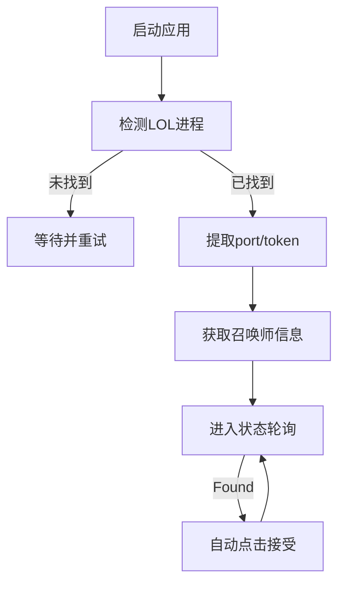

# Lol接受助手

##  一、目标描述

开发一个使用 Tauri 2.0 构建的跨平台桌面程序，自动监听英雄联盟客户端状态，并在匹配成功时自动点击“接受”按钮。程序应保持轻量、稳定、支持后台运行，前端展示召唤师信息及状态反馈。

---

## 二、技术架构
### Tauri + React + Typescript

# 三、功能模块拆解（适配 Tauri 2.0）

## 请求管理员权限

## 英雄联盟客户端连接与认证

**需求：**

* 检测 `LeagueClientUx.exe` 进程

* 读取其命令行参数，提取：

* `--app-port`

* `--remoting-auth-token`

* 组合 LCU 请求所需的认证信息

**Tauri 实现：**

* Rust 后端使用 `sysinfo` 或 `winapi` 实现进程解析

* `tauri::command` 提供 `get_lcu_auth()` 给前端调用

* 保存 `{port, token, base_url}` 信息供后续请求使用

---

## 获取召唤师信息

**接口：**

* `GET /lol-summoner/v1/current-summoner`

**返回信息：**

* `displayName`

* `accountId`

* `profileIconId`

**Tauri 实现：**

* Rust 请求接口，解析为结构体，发送给前端（JSON 格式）

* 前端根据 `profileIconId` 拼接头像 URL：

```

https://ddragon.leagueoflegends.com/cdn/14.11.1/img/profileicon/{profileIconId}.png

```

---

## 轮询匹配状态 + 自动接受

**轮询接口：**

* `GET /lol-lobby/v2/lobby/matchmaking/search-state`

**自动点击接口：**

* `POST /lol-matchmaking/v1/ready-check/accept`

**状态说明：**

| 状态值         | 含义   | 动作     |

| ----------- | ---- | ------ |

| `Searching` | 匹配中  | 显示状态   |

| `Found`     | 匹配成功 | 自动发送接受 |

| `Canceled`  | 匹配取消 | 重置状态   |

**Tauri 实现：**

* 使用 Rust + `tokio` 在后台运行持续轮询任务

* 状态变化时用 `app.emit_all("status-update", payload)` 通知前端

* 自动调用 `/accept` 请求确认匹配

# 四、系统行为流程图



## ✅ 最终可交付成果

* 一个Windows的桌面程序

* 支持实时监听 LOL 匹配状态，自动接受

* 展示召唤师基础信息

* 前端界面简洁，支持自动接受开关

---
